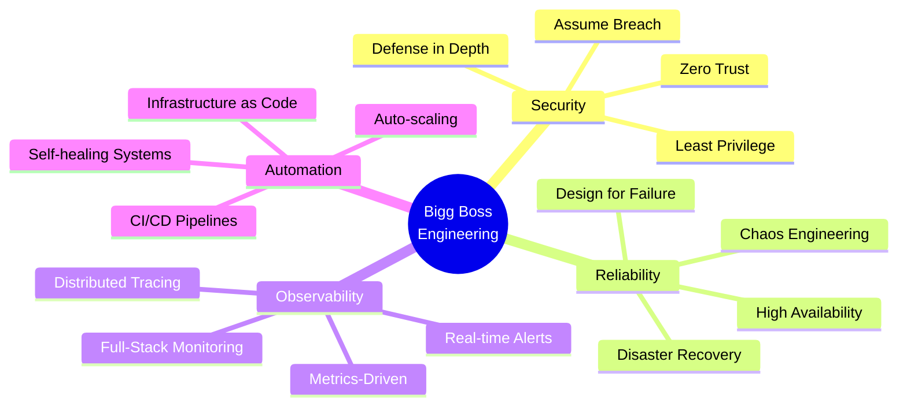

<!-- ===================================== -->
<!-- BIGG BOSS | ELITE SYSTEMS ARCHITECT -->
<!-- ===================================== -->

<div align="center">

<!-- Premium Animated Header -->


<!-- Typing Animation -->


<!-- Profile Badges -->
<p>
  <a href="https://biggboss.tech">
    
  </a>
  <a href="https://github.com/iambiggboss">
    
  </a>
  
  
</p>

<!-- Animated Divider -->


</div>

---

## 🎯 About Me


```yaml
name: Bigg Boss
role: Founder & Systems Architect
company: The Bigg Boss Technologies
location: Building the Future, Globally
focus:
  - Full-Stack Infrastructure
  - Security Engineering
  - DevOps & SRE
  - Cloud Architecture
  - Zero-Trust Systems

philosophy: |
  "Systems that survive production 
   pressure, not just pass staging tests"

status: 🚀 Building production-grade systems
learning: 📚 CCNA, AWS Solutions Architect, CKA
```

### 🎓 Professional Journey
- 🏢 **Founder** @ The Bigg Boss Technologies
- 🔐 **Security-First** engineering mindset
- 🌐 **Full-Stack** infrastructure expertise
- ⚡ **Production-Grade** system designer
- 🎯 **Zero-Trust** architecture advocate

---

## 🏗️ The Bigg Boss Technologies: What We Build

<table>
<tr>
<td width="50%" valign="top">

### 💻 Software Engineering
```typescript
const services = {
  webApps: ["SPAs", "Progressive Web Apps"],
  apis: ["RESTful", "GraphQL", "gRPC"],
  architecture: ["Microservices", "Serverless"],
  auth: ["OAuth 2.0", "JWT", "SAML"],
  databases: ["SQL", "NoSQL", "NewSQL"]
}
```

**Technologies:**
- Modern JavaScript/TypeScript
- Python, Go, Rust
- React, Vue, Next.js
- Node.js, Django, FastAPI

</td>
<td width="50%" valign="top">

### ☁️ Cloud & Infrastructure
```python
infrastructure = {
    "platforms": ["AWS", "Azure", "GCP"],
    "orchestration": ["Kubernetes", "Docker Swarm"],
    "iac": ["Terraform", "Ansible", "Pulumi"],
    "ci_cd": ["GitHub Actions", "GitLab CI", "ArgoCD"],
    "monitoring": ["Prometheus", "Grafana", "Datadog"]
}
```

**Capabilities:**
- Multi-cloud deployments
- Container orchestration
- Infrastructure as Code
- GitOps workflows

</td>
</tr>
<tr>
<td width="50%" valign="top">

### 🔐 Security Engineering
```bash
security_layers=(
  "Network Security"
  "Application Security"
  "Data Encryption"
  "Identity & Access Management"
  "Threat Detection & Response"
  "Compliance & Auditing"
)
```

**Services:**
- Penetration testing
- Vulnerability assessments
- Security automation
- Compliance frameworks (SOC2, ISO 27001)

</td>
<td width="50%" valign="top">

### 📊 Observability & SRE
```go
type Observability struct {
    Logging     []string // ELK, Loki, Splunk
    Metrics     []string // Prometheus, InfluxDB
    Tracing     []string // Jaeger, Zipkin
    APM         []string // New Relic, Datadog
    Alerting    []string // PagerDuty, OpsGenie
}
```

**Focus Areas:**
- Real-time monitoring
- Distributed tracing
- SLO/SLA management
- Incident response

</td>
</tr>
</table>

> **Our Commitment:** We build **real production systems** for **real businesses** — not demos or proofs-of-concept.

---

## 🎯 Engineering Philosophy & Principles

<div align="center">



</div>

<table align="center">
<tr>
<td align="center" width="20%">
<br/>
<b>Assume Breach</b><br/>
<sub>Design systems that remain secure even when perimeter defenses fail</sub>
</td>
<td align="center" width="20%">
<br/>
<b>Design for Failure</b><br/>
<sub>Build fault-tolerant systems with graceful degradation</sub>
</td>
<td align="center" width="20%">
<br/>
<b>Secure by Default</b><br/>
<sub>Security integrated from day one, not bolted on later</sub>
</td>
<td align="center" width="20%">
<br/>
<b>Observe Everything</b><br/>
<sub>Comprehensive logging, metrics, and tracing</sub>
</td>
<td align="center" width="20%">
<br/>
<b>Automate Relentlessly</b><br/>
<sub>Eliminate toil and human error</sub>
</td>
</tr>
</table>

### 🎖️ Core Beliefs

> **"Production pressure reveals truth. Systems must thrive under it, not just survive it."**

- ✅ Ship fast, but ship **secure**
- ✅ Optimize for **reliability**, then performance
- ✅ **Measure everything**, improve continuously
- ✅ Automation is **mandatory**, not optional
- ✅ Documentation is **code**, not an afterthought

---

## ⚠️ Threat Model: Real-World Attack Scenarios

<details open>
<summary><b>🔴 Security Threats (Click to expand)</b></summary>
<br/>

| Threat Vector | Attack Scenario | Our Defense |
|--------------|-----------------|-------------|
| **Credential Compromise** | API keys leaked via Git, logs, or social engineering | Secret scanning, rotation, vault management |
| **Network Intrusion** | Perimeter breach → lateral movement → privilege escalation | Zero-trust networking, microsegmentation, MFA |
| **Application Attacks** | OWASP Top 10: injection, XSS, CSRF, broken auth | WAF, input validation, security headers, CSP |
| **Supply Chain** | Compromised dependencies, backdoored libraries | SCA, SBOM, signature verification, private registries |
| **Insider Threats** | Malicious/negligent privileged user actions | RBAC, audit logging, anomaly detection, least privilege |
| **DDoS Attacks** | Volumetric, protocol, or application-layer floods | CDN, rate limiting, geo-blocking, autoscaling |
| **Data Exfiltration** | Unauthorized data extraction via API or database | DLP, encryption, access controls, egress monitoring |

</details>

<details>
<summary><b>🟡 Operational Failures (Click to expand)</b></summary>
<br/>

```ascii
┌─────────────────────────────────────────────────────────────┐
│ FAILURE SCENARIO              │ MITIGATION STRATEGY          │
├───────────────────────────────┼──────────────────────────────┤
│ Cloud Provider Outage         │ Multi-region deployments     │
│ Database Corruption           │ Automated backups + PITR     │
│ Cascading Service Failures    │ Circuit breakers + retries   │
│ Configuration Drift           │ GitOps + automated testing   │
│ Capacity Exhaustion           │ Auto-scaling + monitoring    │
│ Human Error (bad deploys)     │ Blue-green + canary releases │
│ Network Partitions            │ Eventual consistency design  │
│ Certificate Expiry            │ Automated renewal + alerts   │
└───────────────────────────────┴──────────────────────────────┘
```

</details>

<details>
<summary><b>🟢 Scale & Performance Issues (Click to expand)</b></summary>
<br/>

**Traffic Spikes:** Horizontal autoscaling, CDN caching, rate limiting  
**Resource Exhaustion:** Memory profiling, connection pooling, garbage collection tuning  
**Database Bottlenecks:** Read replicas, query optimization, caching layers (Redis)  
**Third-Party Dependencies:** Circuit breakers, fallback mechanisms, retry with exponential backoff  
**Cold Starts:** Provisioned concurrency, warm pools, connection pre-warming  

</details>

---

## 🧰 Technology Arsenal

<div align="center">

### 👨‍💻 Programming Languages


### 🚀 Frameworks & Libraries


### ☁️ Cloud & Infrastructure


### 🗄️ Databases & Caching


### 📊 Monitoring & Observability


### 🔐 Security Tools


### 🛠️ DevOps & CI/CD


</div>

---

## 📊 GitHub Analytics & Performance

<div align="center">

<!-- GitHub Stats - Using correct API -->
<a href="https://github.com/iambiggboss">
  
</a>

<!-- GitHub Streak - Using correct service -->
<a href="https://github.com/iambiggboss">
  
</a>

<!-- Top Languages - Compact version -->
<a href="https://github.com/iambiggboss">
  
</a>

<!-- Activity Graph - Using correct service -->
<a href="https://github.com/iambiggboss">
  
</a>

<!-- GitHub Trophies -->
<a href="https://github.com/iambiggboss">
  
</a>

</div>

---

## 🐍 Contribution Snake Animation

<div align="center">

<picture>
  <source media="(prefers-color-scheme: dark)" srcset="https://raw.githubusercontent.com/iambiggboss/iambiggboss/output/github-contribution-grid-snake-dark.svg">
  <source media="(prefers-color-scheme: light)" srcset="https://raw.githubusercontent.com/iambiggboss/iambiggboss/output/github-contribution-grid-snake.svg">
  
</picture>

</div>


---

## 🎓 Certifications & Continuous Learning

<div align="center">

### 📚 Current Focus Areas

<table>
<tr>
<td align="center" width="33%">
<br/>
<b>🌐 Networking</b><br/>
<sub>CCNA Track</sub><br/>
<sub>Network Security</sub><br/>
<sub>Enterprise Infrastructure</sub>
</td>
<td align="center" width="33%">
<br/>
<b>☁️ Cloud Architecture</b><br/>
<sub>AWS Solutions Architect</sub><br/>
<sub>Multi-Cloud Strategy</sub><br/>
<sub>Cloud Security</sub>
</td>
<td align="center" width="33%">
<br/>
<b>🐳 Kubernetes</b><br/>
<sub>CKA (Certified K8s Admin)</sub><br/>
<sub>Service Mesh</sub><br/>
<sub>GitOps Workflows</sub>
</td>
</tr>
</table>

### 🔬 Research & Innovation

```python
research_areas = {
    "security": [
        "Zero-trust architecture patterns",
        "eBPF for security & networking",
        "Runtime application security",
        "Supply chain security"
    ],
    "reliability": [
        "Chaos engineering methodologies",
        "Service mesh architectures",
        "Progressive delivery strategies",
        "Observability best practices"
    ],
    "performance": [
        "WebAssembly for edge computing",
        "Distributed systems optimization",
        "Database performance tuning",
        "CDN & caching strategies"
    ]
}
```

</div>

---

## 🌐 Connect & Collaborate

<div align="center">

### 💬 Let's Build Something Amazing Together

<table>
<tr>
<td align="center">
<a href="https://biggboss.tech">

</a>
</td>
<td align="center">
<a href="https://github.com/iambiggboss">

</a>
</td>
<td align="center">
<a href="https://linkedin.com/in/yourprofile">

</a>
</td>
<td align="center">
<a href="https://twitter.com/yourhandle">

</a>
</td>
</tr>
<tr>
<td align="center">
<a href="mailto:contact@biggboss.tech">

</a>
</td>
<td align="center">
<a href="https://discord.gg/GcrVsj7chg">

</a>
</td>
<td align="center">
<a href="https://t.me/yourhandle">

</a>
</td>
<td align="center">
<a href="https://dev.to/yourhandle">

</a>
</td>
</tr>
</table>

### 📧 Business Inquiries
**Email:** info@biggboss.tech  
**Response Time:** Within 24 hours

</div>

---

## 💡 Random Dev Wisdom

<div align="center">


</div>

---

## ☕ Support My Work

<div align="center">

If you find value in my projects or insights, consider supporting my work:

<a href="https://buymeacoffee.com/biggboss">
  
</a>
<a href="https://patreon.com/biggboss">
  
</a>
<a href="https://github.com/sponsors/iambiggboss">
  
</a>

### 🌟 Your Support Helps Me:
- 🔬 Research cutting-edge technologies
- 📚 Create educational content
- 🛠️ Build open-source tools
- 🌍 Contribute to the developer community

</div>

---

## 🚀 Final Words

<div align="center">

### *"Good systems survive pressure. Great systems thrive under it."*


```ascii
╔══════════════════════════════════════════════════════════════════════╗
║                                                                      ║
║  This profile reflects how I architect and engineer systems,         ║
║  not just a collection of tools I've used.                           ║
║                                                                      ║
║  If you're passionate about building production-grade,               ║
║  secure, observable infrastructure — let's connect.                  ║
║                                                                      ║
╚══════════════════════════════════════════════════════════════════════╝
```

**⭐ Star my repositories if you find them valuable!**  
**🔔 Follow for updates on new projects and insights**

---

### 📊 Proudly Serving


</div>

---

<div align="center">

<!-- Footer Wave -->


**Made with 💙 by Bigg Boss** | **Last Updated: 2026**

</div>
