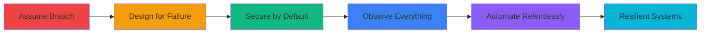

<!-- ===================================== -->
<!-- BIGG BOSS | SYSTEMS ARCHITECT -->
<!-- ===================================== -->

<div align="center">

<!-- Dynamic Typing Header -->


### Building production-grade systems engineered for scale, resilience, and security.

[](https://biggboss.tech)
[](https://github.com/iambiggboss)

</div>

---

## 🧠 About Me

```ascii
┌─────────────────────────────────────────────────────────────┐
│  Nickname: Bigg Boss                                        │
│  Role:     Founder & Systems Architect                      │
│  Company:  The Bigg Boss Technologies                       │
│  Focus:    Full-Stack Infrastructure & Security Engineering │
└─────────────────────────────────────────────────────────────┘
```

I architect and build **production systems** across the entire IT lifecycle — from initial design through deployment, security hardening, and continuous operations. My work spans **software development, infrastructure engineering, cybersecurity, and DevOps**.

---

## 🏗️ What We Build at The Bigg Boss Technologies

<table>
<tr>
<td width="50%">

### 💻 Software Engineering
- Modern web applications & SPAs
- RESTful & GraphQL APIs
- Microservices architectures
- Authentication & authorization systems
- Database design & optimization

</td>
<td width="50%">

### ☁️ Infrastructure & Cloud
- Multi-cloud & hybrid deployments
- Container orchestration (K8s/Docker)
- Infrastructure as Code (Terraform/Ansible)
- CI/CD pipelines & automation
- High-availability architectures

</td>
</tr>
<tr>
<td width="50%">

### 🔐 Security Engineering
- Threat modeling & risk assessment
- Penetration testing & vulnerability management
- Zero-trust architecture implementation
- Security monitoring & incident response
- Compliance & hardening standards

</td>
<td width="50%">

### 📊 Operations & Observability
- Centralized logging & metrics (ELK, Prometheus)
- Distributed tracing & APM
- Alert design & on-call optimization
- Disaster recovery planning
- Performance tuning & optimization

</td>
</tr>
</table>

> **We build real systems for real businesses** — not proof-of-concepts or demos.

---

## 🎯 Engineering Philosophy

<div align="center">



</div>

| Principle | Implementation |
|-----------|----------------|
| **🔴 Assume Breach** | Design systems that remain secure even when perimeter defenses fail |
| **🟡 Design for Failure** | Build fault-tolerant systems with graceful degradation |
| **🟢 Secure by Default** | Security is integrated from day one, not bolted on later |
| **🔵 Observe Everything** | Comprehensive logging, metrics, and tracing across all layers |
| **🟣 Automate Relentlessly** | Eliminate toil and human error through intelligent automation |

### Core Belief
> Systems must **survive pressure in production**, not just pass tests in staging.

---

## ⚠️ Threat Model: What We Design Against

<details>
<summary><b>🔐 Security Threats</b></summary>

- **Credential Compromise:** API keys, tokens, passwords leaked via Git, logs, or social engineering
- **Network Intrusion:** Perimeter breach leading to lateral movement and privilege escalation
- **Application Attacks:** OWASP Top 10 (injection, XSS, CSRF, broken auth, etc.)
- **Supply Chain:** Compromised dependencies, malicious packages, backdoored libraries
- **Insider Threats:** Malicious or negligent actions by privileged users

</details>

<details>
<summary><b>💥 Operational Failures</b></summary>

- **Infrastructure Outages:** Cloud provider failures, network partitions, hardware degradation
- **Cascading Failures:** Single point of failure triggering system-wide collapse
- **Data Loss:** Corruption, accidental deletion, ransomware attacks
- **Configuration Drift:** Undocumented changes leading to unexpected behavior
- **Human Error:** Misconfigurations, accidental deployments, inadequate rollback procedures

</details>

<details>
<summary><b>📈 Scale & Performance Issues</b></summary>

- **Traffic Spikes:** Sudden load increases overwhelming capacity
- **Resource Exhaustion:** Memory leaks, disk space, connection pool depletion
- **Database Bottlenecks:** Slow queries, lock contention, replication lag
- **Third-Party Dependencies:** API rate limits, external service degradation

</details>

---

## 🧬 System Architecture Thinking

```
┌─────────────────────────────────────────────────────────────────────┐
│                         FULL-STACK SYSTEMS                          │
├─────────────────────────────────────────────────────────────────────┤
│  Network Layer         │  Foundation of connectivity & security     │
│  Infrastructure Layer  │  Compute, storage, orchestration           │
│  Application Layer     │  Business logic, APIs, user interfaces     │
│  Security Layer        │  Defense in depth across all levels        │
│  Observability Layer   │  Monitoring, logging, tracing, alerting    │
└─────────────────────────────────────────────────────────────────────┘
```

Every layer is designed **holistically**, secured **by default**, and monitored **continuously**.

---

## 📊 GitHub Analytics

<div align="center">


</div>

---

## 🐍 Contribution Visualization

<div align="center">

<picture>
  <source media="(prefers-color-scheme: dark)" srcset="https://raw.githubusercontent.com/iambiggboss/iambiggboss/output/github-contribution-grid-snake-dark.svg">
  <source media="(prefers-color-scheme: light)" srcset="https://raw.githubusercontent.com/iambiggboss/iambiggboss/output/github-contribution-grid-snake.svg">
  
</picture>

</div>

> 💡 **Note:** Requires GitHub Actions workflow enabled. See [setup instructions](#-setup-instructions) below.

---

## 🧰 Technology Stack

<div align="center">

### Languages & Frameworks


### Infrastructure & DevOps


### Security & Monitoring


### Databases


</div>

---

## 🎓 Continuous Learning & Certifications

```
📚 Currently Pursuing:
  ├─ CCNA (Cisco Certified Network Associate)
  ├─ AWS Solutions Architect
  └─ Certified Kubernetes Administrator (CKA)

🔬 Active Research Areas:
  ├─ Zero-trust architecture patterns
  ├─ Service mesh & observability
  ├─ eBPF for security & networking
  └─ Chaos engineering & resilience testing
```

---

## 📫 Connect & Collaborate

<div align="center">

[](https://biggboss.tech)
[](https://github.com/iambiggboss)
[](https://linkedin.com/in/yourprofile)
[](mailto:contact@biggboss.tech)

</div>

---

## 🚀 Final Note

This profile reflects **how I architect and engineer systems**, not just a list of technologies I've touched.

If you're building **production-grade, secure, observable infrastructure** and want to collaborate or discuss system design — let's connect.

<div align="center">

### *"Good systems survive pressure. Great systems thrive under it."*

---


**⭐ If you find this profile interesting, consider starring some of my repositories!**

</div>

---

## 🛠️ Setup Instructions

<details>
<summary><b>How to enable the contribution snake animation</b></summary>

1. Create `.github/workflows/snake.yml` in your profile repository:

```yaml
name: Generate Snake

on:
  schedule:
    - cron: "0 0 * * *"  # Runs daily at midnight
  workflow_dispatch:

jobs:
  generate:
    runs-on: ubuntu-latest
    steps:
      - uses: Platane/snk@v3
        with:
          github_user_name: iambiggboss
          outputs: |
            dist/github-contribution-grid-snake.svg
            dist/github-contribution-grid-snake-dark.svg?palette=github-dark
        env:
          GITHUB_TOKEN: ${{ secrets.GITHUB_TOKEN }}
      
      - uses: crazy-max/ghaction-github-pages@v3
        with:
          target_branch: output
          build_dir: dist
        env:
          GITHUB_TOKEN: ${{ secrets.GITHUB_TOKEN }}
```

2. Enable GitHub Actions in your repository settings
3. Run the workflow manually or wait for the scheduled run
4. The snake animation will appear in your README

</details>

---

<div align="center">

Made with 💙 by **Bigg Boss** | Last updated: 2026

</div>
